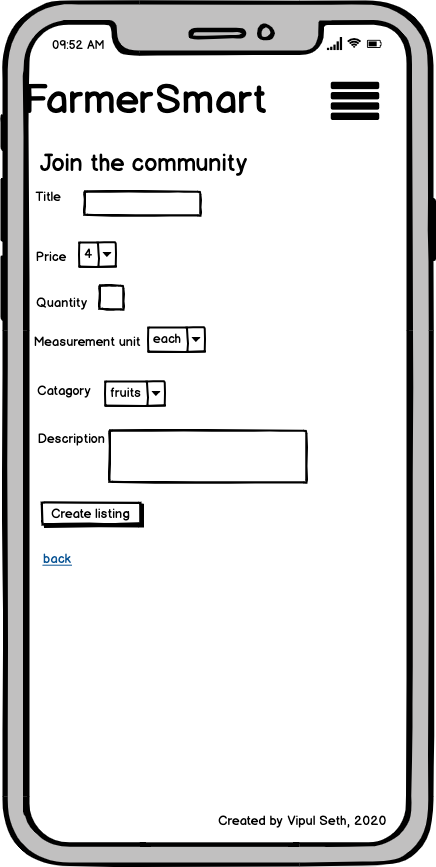

## FarmerSmart (A Two sided marketplace app)

### Link to FarmerSmart: https://secure-brook-35449.herokuapp.com/

### Link to GitHub repo: https://github.com/vipul022/farmersmart-

## Introduction:

FarmerSmart is a two sided market place app which is highly beneficial for both farmers and consumers. This allow farmers to sell their various products such as vegetables, fruits, seeds, herbs etc directly to consumers. This provides an online platform to consumers to buy the products directly from farmers at affordable prices.

## Identification of the problem

I have lived in various parts of Melbourne and I have always noticed that there is a lot of difference in prices of products of different vegetable shops at different locations. For example, the price of ginger is $10 per kg in St. Albans and the same quality of ginger in sold at $20 per kg in Melton. I also did some research on some existing online platforms during the planning phase of my app. I found that Facebook market place provide an online selling platform to buy and sell the products. I observed number of flaws in Facebook marketplace, which I noted down so that I can overcome them in my app. For example there is no provision for making secure and safe transactions. Moreover Facebook market place is only suitable for people who are existing Facebook user, in this way it not accessible to non Facebook user.

I also did the analysis of another website i.e. https://www.harrisfarm.com.au/

I identified a big problem as soon I opened the website. The following banner is placed on the top of the navbar.

```
FREE DELIVERY ON YOUR FIRST 3 ONLINE ORDERS OVER $80!
```

This clearly indicates that free delivery is only for first 3 orders over $80. When I clicked on the listings to check the prices, I noticed another problem that the minimum order for click on collect should be $50. These conditions of this website made me clear that this is not a platform for farmers to sell their products directly to consumers. The business model of this website is to buy the products from farmers in bulk and sell them to vegetable shops, restaurants, cafes etc. This does not suits the shopping pattern of common people, where people like to buy fresh vegetables and fruits on weekly basis. I have personally tried sometimes to buy the vegetables and fruits in big quantity in order to get a good deal. But It has resulted in a lot of wastage as the products does not remain fresh after few days and eventually I had to throw them in the bin. In this way these online platforms did not meet my expectations, so I have tried to over come these imperfections in my app.

## Purpose of FarmerSmart

The purpose of FarmerSmart is to provide an online platform to farmers and consumers to connect with each other. This platform allow farmers to make more profits by getting rid of the middleman and selling their fresh products directly to consumers. The direct communication between farmers and consumers also make it easier for consumers to understand the various modern techniques that are used by farmers so that they can use that knowledge to grow some vegetables/herbs in their backyards. This helps consumers in buying the fresh products at affordable prices and reducing the wastage. This platform provides a safe and secure third party transaction system i.e. Stripe.

## Functionality / features

- The Signup functionality allow new users to sign up and create their account so that they can buy or sell the listings. The existing users can simply login to their their account by using their email and password which is managed by Devise gem in the app.

- The app allow farmers to add new listings with complete details such as title, category, price, measurement unit, description, photo etc. The farmers are authorized to edit and delete their own listings.

- The app allow all signed in users to view and edit their own profile.

- The app allow users to view the location and other details of the farmer and all the listings that belongs to that farmer.

* The Search bar is on the top right corner of the navbar. This allow all the users to search for a listing by it's title.

- The Cart feature allow consumers to add the desired listings to their cart and also allow to delete the listings from their cart.

- The app provides a safe and secure third party transaction system through Stripe.

# Site Map

- User signed in


- User not signed in


## Target Audience

The target audience of FarmerSmart is all the common people/consumers and farmers who have any smart device with internet access to make the best use of the app. This allow consumers to buy fresh and nutritious products at affordable prices and make safe and secure transaction through third party payment system. Farmers are able to sell their products directly to consumers. This increases their profits by getting rid of the middleman.

## Tech stack

- Ruby on Rails: For backend
- Postgres database: For data persistance
- HTML: For structuring the basic layouts
- SASS: For adding style
- Boostrap: For adding style
- Heroku: For deployment
- Devise: For adding user authentication
- CanCanCan: For adding authorization so that user can edit or delete his own listing only
- Stripe: A third part payment system for safe and secure transactions.
- Ultrahook: For getting public webhook end point to link with stripe for receiving payment information.
- AWS S3: For storing the uploaded images in cloud storage.
- GIT: A version control system for tracking my changes in source code.

## User stories

Guest:

1. As a guest user, I want to view all the listings and farmer's profile associated with a particular listing.

2. As a guest user, I want to sign in/sign out securely and sell or buy products.

Buyer/Consumer:

1. As a buyer, I want to view all the listings.
2. As a buyer, I want to view the details of a particular listing such as title,category, photo, price,etc.
3. As a buyer I want to view a farmer's profile and see all other products of the farmer.
4. As a buyer, I want to add the desired listings in the cart.
5. As a buyer, I want to make a safe and secure transaction for my shopping.

## Farmers:

1. As a farmer,I want to view all the listings.
2. As a farmer,I want to view and edit my profile details.
3. As a farmer, I want to create new listings and add all the details regarding my listing such as title, picture, price, quantity etc.
4. As a farmer, I want edit my listings to let buyers know about any changes.
5. As a farmer, I want to completely delete my own listing if it is not in stock anymore.
6. As a farmer, I want receive payments quickly safely into my account..

## Wireframes

Create listing page (desktop view)


Create listing page (mobile view)



Index page(desktop view)


Index page(mobile view)


Home page(desktop view)


Home page(mobile view)


Login page(desktop view)


Login page(mobile view)


Show page(desktop page)


Show page(mobile page)


Sign up page(desktop view)


Sign up page(mobile view)


User show page(desktop view)


User show page(mobile view)


Cart page(desktop view)


Cart page(mobile view)


## Entity Relationship Diagram

### Initial ERD


### Final ERD


## Database Schema design

```Table user{
      id int [pk, increment] // auto-increment
      first_name string
      last_name string
      email string
      password string
      bio text
      profile_pic string

  }

  Table listings {
     id int [pk, increment] // auto-increment
     title string
     description text
     photo string
     price int
     quantity int
     catagory_id int [ref: < catagory.id]
     measurement_unit_id int [ref: < measurement_unit.id]
     user_id int [ref: < user.id]
  }


  Table address {
     id int [pk, increment] // auto-increment
     street string
     suburb string
     city string
     state string
     country string
     user_id int [ref: < user.id]
  }

  Table catagory{
     id int [pk, increment] // auto-increment
     name string
  }


  Table measurement_unit {
     id int [pk, increment] // auto-increment
     name string
  }

  Table cart {
     id int [pk, increment] // auto-increment
     user_id int [ref: < user.id]
     completed boolean
  }

  Table cart_listings {
     id int [pk, increment] // auto-increment
     cart_id int [ref: < cart.id]
     listing_id int [ref: < listings.id]

  }

```

## High level components(abstractions) of the App

- ### Active Record

Active Record is represented as M in MVC(Model View Controller) architecture in rails applications. Active Record provides Object Relational Mapping system that is responsible for connecting objects of the application to the tables of relational database. ORM provides some built in methods that allow developers to perform CRUD operations(Create, Read, Update and Destroy) in database without writing SQL statements. As a result less code is required to access the data from database.

Active Record as an ORM framework holds the responsibility for representing all the models of the application and their data. This also represents all the associations between these models and allow developers to add validations to these models so that correct data is saved in the relational database.

All the models in the rails application are inherited from ApplicationRecord. The following example shows that User model in the app is inherited from ApplicationRecord:

```
class User < ApplicationRecord
end
```

ApplicationRecord is is further inherited from Active Record which is described as following:

```
class ApplicationRecord < ActiveRecord::Base
  self.abstract_class = true
end
```

- ### Action Controller

Action Controller is represented as C in MVC(Model View Controller) architecture in rails applications. It holds the responsibility for managing HTTP requests coming from browser thorough rails routes which are defined in routes.rb file in the app. There are some methods defined in the controller which give command to the controller to respond according to the type of HTTP request.

The controller acts as a glue between models and views. Depending upon the type of HTTP request(get,post,edit etc), controller is responsible for fetching the data from models and passing it to the views create HTML output for the user. It can also save, update and delete the data to the model.

All the controllers in the rails application are inherited from ApplicationController. The following example shows that Users controller in the app is inherited from ApplicationController:

```
class UsersController < ApplicationController

  def show

  end
end
```

ApplicationController is is further inherited from ActionController which is described as following:

```
class ApplicationController < ActionController::Base

  end

```

- ### Action View

Action View is represented as V in MVC(Model View Controller) architecture in rails applications. Action View provide some built in helper methods such as form helpers which help developers to keep their code DRY while rendering HTML views in the browser. For every controller there is a corresponding view directory and every controller action that requires a view, there is a view file in that directory with the same name as action with html.erb extension.

In Action View, the final HTML output is made up of the following three Rails components:

1. Templates: Embedded Ruby(ERB) is mixed with HTML to create a template if it has .erb extension. Ruby code can also be added inside ERB template using special tags(<% %> and <%= %> ).

2. Partials: Partial templates are used in splitting the process of rendering into smaller chunks of code which can be reused into different templates in the application.

3. Layouts: Layouts are used to display the common templates on all the pages of website. They can be used in a website to display different links on navbar for different type of users.

## Third Party Services

I have used the following third party services to add more features to my app:

- Devise

I have used Devise in my app to add authentication to user's account. It works by saving the password in the database and verifies the authentication of user while signing in. It allows the users to sign up by following a registration process and give authority to edit or destroy their account. It permits the user to recover their account and reset their passwords. I have also used Devise helpers(user_signed_in?, current_user, user_session
) inside my controllers and views to add authorizations.

- CanCanCan

I have also used a CanCanCan ruby gem for adding more authorization in my app. It authorizes the user to edit and delete their own listings only.

- Bootstrap

Bootstrap is a HTML, css and javascript library which provides built up components such as forms, buttons, navbars etc. to use in the app. I have used Bootstrap classes to style my navbar, buttons and other components of my app.

- Stripe

Stripe is a software that provides a safe and secure payment system to make transactions. I have used Stripe in my app to allow users to checkout from their cart and make transactions safely and quickly.

- Ultrahook

I have used Ultrahook in my app which provided me with internet reachable url(end point) which I linked with my Stripe account. This allowed me to receive real time information about the transactions from Stripe while the app was running on localhost:3000.

- AWS S3

AWS S3 is a cloud storage service provided by Amazon. I have used this service in my app to save the uploaded images in cloud.

- rubocop-rails

Rubocop-rails is a ruby gem which is used to remove unwanted weirdness from the source code. I have used it mainly for indenting my code.

## app's models and associations and their implementation

I have created following seven key models in my app:

1. User
2. Listing
3. Category
4. Measurement unit(munit)
5. Address
6. Cart
7. Cart_listings

Below is the detailed explanation of all the models and their associations with each other:

### User

- has many listings

The user model 'has one to many' relation with listing model as it is described as a 'User has many listings' and a 'Listing belongs to a User'. A user is referenced in listings table as User_id which is a foreign key. I have also used 'dependent: :destroy ' with this association to ensure that if user is destroyed, all the listings that belongs to the user gets destroyed as well so that it does not leave an orphaned record in database.

- has one address

The user model has 'one to one' relation with address model as it is described as a 'User has one address' and an' Address belongs to a User'. A user is referenced in addresses table as User_id which is a foreign key. I have also used 'dependent: :destroy ' with this association to ensure that if user is destroyed, the address that belongs to the user is also destroyed to avoid having an orphaned record in the database.

- has one cart

The user model has 'one to one' relation with cart model as it is described as a 'User has one cart' and a ' Cart belongs to a User'. A user is referenced in carts table as User_id which is a foreign key. I have also used 'dependent: :destroy ' with this association to ensure that if user is destroyed, the cart that belongs to the user is also destroyed to avoid having an orphaned record in the database.

### Listing

- belongs to category

The Listing model has 'one to many' relation with category model which is represented as a 'Category has many listings' and a 'Listing belongs to a category'. This implies that a category can be in many listings and a listing can has only one category. Category is represented in listings table as Category_id which is a foreign key.

- belongs to munit (measurement unit)

The Listing model has 'one to many' relation with munit model which is represented as a 'Munit has many listings' and a 'Listing belongs to a munit'. This implies that a munit can be in many listings and a listing can has only one munit. Munit is represented in listings table as Munit_id which is a foreign key.

- has many cart_listings
- has many carts, through cart_listings

The listing model has ' many to many' relation with cart model through a join table which is cart_listings. This implies that a ' Cart has many cart_listings' and a ' Cart has many listings through cart_listings' and also a 'Listing has many cart_listings' and a ' Listing has many carts through cart_listings'. In this this way Cart_listing model belongs both to Listing and Cart model. This also allow users to add as many listings in a cart and a listing can be present in many carts of different users. This relation has been used in carts controller to add a listing to a cart and delete a listing from cart as well.

## Tasks allocations and project management

Before starting the development of my app, I spent some time in planning. I presented the idea of my app to my educators and after getting the approval, I started doing further research about similar online platforms which allow farmers to sell their products. I noted down some flaws in those websites which I have tried to overcome in my app. I spent first three days in doing some initial documentation which included making ERD and wire frames along with writing user stories. This gave me a clear picture in my mind about my app such as how many models will I have and what will be their associations with each other. I have tracked all my activities during the development of my app using trello board. Below are some screenshots of my trello board:


```
The End!
```
